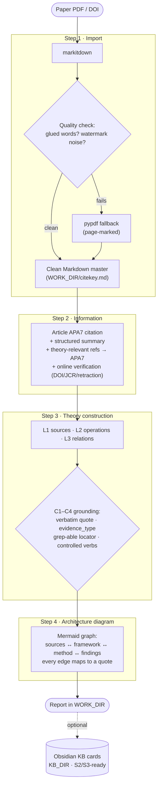

# literature-single-paper-decompose

> **Author**: Wen-Cheng Lin　｜　**Experimental skill**
>
> ⚠️ Designed to reduce AI fabrication, but it **cannot guarantee zero errors**. Treat the output as a research aid and **verify important citations and theory attributions yourself**. Whether to use it is your call. （中文摘要見文末。）

A [Claude Code](https://claude.com/claude-code) **skill** that turns a single academic paper into a **traceable, low-hallucination theory-construction analysis** plus an architecture diagram.

Core value — **every claim can be `grep`-ed back to the source text, and "what the paper explicitly says" is kept strictly separate from "what the analyst inferred."**

---

## Why

Fabricated or misattributed citations are an increasing risk (especially in AI-assisted writing). But the most insidious hallucination when *summarizing* a paper is not inventing the original source — it is **over-interpreting the analyzed text itself**: passing off the analyst's own labels as the paper's words. This skill enforces a set of mechanically auditable conditions to hold that line.

**Cardinal rule:** describe only *how the paper uses a reference / constructs its theory* (citation context). **Never** assert *what the original source actually claims* — that requires reading the original and belongs to a later layer.

## Pipeline



## Anti-hallucination conditions (C1–C4)

Every theory-relation claim in Step 3 (and every edge in Step 4) must satisfy:

| # | Condition | Guards against |
|---|---|---|
| **C1** | Attach the paper's **verbatim quote** (no paraphrase, no page-only) | interpretation drift |
| **C2** | Tag `evidence_type`: `explicit` (paper states it, quoted) vs `interpreted` (analyst's grouping/label) | passing inference off as the paper's words |
| **C3** | Locate via a **grep-able** line/quote in the clean master | citation drift, unverifiable page numbers |
| **C4** | Use a **controlled relation vocabulary** (`draws-on / defines / applies / extends / challenges / repositions / controls-for`) and prefer the paper's own verb | upgrading a weak verb into a stronger claim |

> Self-check: after Step 3, randomly pick 2–3 claims and actually `grep` their quotes against the master. A miss means a locator/quality problem to fix.

## Installation

```bash
# Global (all projects)
git clone https://github.com/ganma0517/literature-single-paper-decompose.git \
  ~/.claude/skills/literature-single-paper-decompose

# Per-project
git clone https://github.com/ganma0517/literature-single-paper-decompose.git \
  <your-project>/.claude/skills/literature-single-paper-decompose
```

Restart Claude Code to load the skill.

**Dependencies:**
- `markitdown` — `pipx install 'markitdown[pdf]'` (needs Python ≥ 3.10)
- `pypdf` — fallback extractor
- `firecrawl` MCP (or any web-search tool) — reference verification
- Optional: Obsidian — long-term knowledge-base cards

## Path configuration (portable)

SKILL.md uses two configurable paths; adjust per project/machine:

| Variable | Purpose | Default |
|---|---|---|
| `WORK_DIR` | Work products (master + step reports) | `./ltm-work/` in the current project |
| `KB_DIR` | Optional long-term knowledge base (Obsidian KB cards) | `literature-kb/` under the user's Obsidian vault |

If unset, defaults are used and the landing location is stated in the report.

## Repository layout

```
.
├── SKILL.md                      # The skill: 4-step pipeline + C1–C4 + Forbidden Actions
├── references/
│   └── schema-contract.md        # Shared three-layer data contract (S1/S2/S3)
└── examples/                     # Real run examples (no source PDFs)
    ├── Chen2026/                 # Political-science empirical paper: step2/3/4 + diagram
    └── Karlson2012/              # Statistical-method paper (KHB method): combined report
```

## Three-layer context

This is **layer one (S1)** of an "LTM knowledge network," deliberately stopping at the citation-context layer to stay low-hallucination:

- **S1 (this skill)** — single-paper decomposition: citation context, existence verification, theory-construction mapping.
- **S2 (future)** — read the *originals* to verify theory claims; build pass-grade theory-claim cards.
- **S3 (future)** — connect verified theory to research design (RQ/H) for writing.

The data contract (`references/schema-contract.md`) already reserves S2/S3 fields so S1 output stays forward-compatible.

## 中文摘要（補充）

本工具用於**單篇學術論文的精讀**，將其整理成一份「**每項論斷皆可回溯至原文**」的分析，並繪製論文的**理論架構圖**。

其核心原則是**嚴格區分「論文明示之內容」與「分析者詮釋之內容」**。AI 在整理論文時最常見的問題，並非憑空虛構，而是**將自身的理解陳述為作者原話**（過度詮釋）。因此本工具要求每項論斷皆須附上原文逐字引文、且須可經文字搜尋驗證，否則不予採用。此外，它**僅描述「本文如何援用某份文獻」**，不宣稱「該文獻原本之主張為何」——後者須回溯原典查證，屬後續工作範疇。

**使用方式**：將論文 PDF 或 DOI 提供給 Claude，並說明「精讀本篇、須可回溯原文、避免自行臆測」即可。產出包含書目（APA7）、結構化摘要、參考文獻查證（含撤稿狀態），以及理論架構圖。

**使用前須留意**：① 本工具**無法保證完全無誤**，重要結果仍須自行覆核；② 查證過程會將論文片段送至外部搜尋服務，第 5 步交叉檢核並會送交其他 AI 模型，**未發表稿件請自行斟酌**；③ API 金鑰屬個人機密，**切勿貼入對話視窗**，僅應存放於本機。

> 完整技術細節以上方英文文件為準。

## License

MIT
