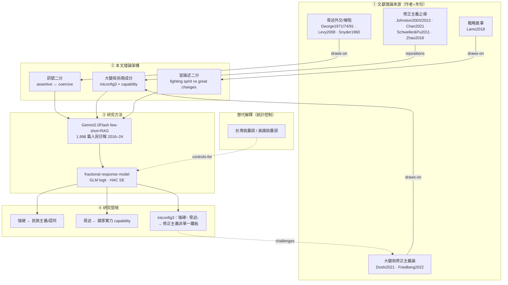

# Chen2026 — 第 4 步：理論架構圖

> ⚠️ **可回溯保證**：圖中**每條理論關係邊**都對應 step3 的受控 `relation` 詞彙與逐字引文（見下方對照表），可 grep 回 `ltm-work/Chen2026.md`。研究發現節點來自 step2（本文實證結果）。圖**不引入**任何未驗證的新主張。

## 架構圖（本文理論架構 ↔ 文獻理論/作者 ↔ 研究方法 ↔ 研究發現）

## 邊—證據對照表（C1–C3 回溯）

| 圖中的邊 | relation (C4) | 本文逐字引文 (C1) | 定位 (C3) | evidence_type (C2) |
|---|---|---|---|---|
| COE → T1 | draws-on | "Drawing on the classic literature on coercive diplomacy and deterrence, we distinguish assertive from coercive signaling" | L513 | explicit |
| NAR → T3 | draws-on | "This strategic narrative adds to the repertoire of Xi-era discursive frameworks" | L371 | explicit |
| DOS → T2 | draws-on | "According to Doshi, this sense of both opportunity and urgency has driven Chinese leadership to reshape global governance structures" | L366 | explicit |
| REV → T2 | repositions | "Johnston's characterization of China as a status quo-seeker may no longer hold regionally" | L187–188 | explicit |
| A1 ⇢ M2 | controls-for | "to control for the alternative explanation attributing Chinese revisionism in the Taiwan Strait to Taiwan's political developments" | L492 | explicit |
| F3 ⇢ DOS | challenges | "offers an important corrective to existing accounts of Chinese revisionism, particularly those advanced by scholars such as Doshi and Friedberg" | L863–864 | explicit |

## 圖例

- **實線**＝理論建構/檢驗流（來源 → 本文架構 → 方法 → 發現）。
- **虛線**＝對話關係：`controls-for`（替代解釋納入統計控制）、`challenges`（發現回頭挑戰 Doshi/Friedberg）。
- L2 三個理論操作（T1/T2/T3）皆經同一套 LLM+統計方法檢驗（M1→M2）。
- 核心貢獻在 **F3 ⇢ DOS** 這條虛線：實證證明大變局內部矛盾，據此挑戰「修正主義＝一致破壞」的主流論。

---

**第 4 步小結**：架構圖把四個面向（文獻來源／本文理論／方法／發現）整合，且每條理論邊都帶 relation 詞彙＋逐字引文＋行號 → **圖本身可稽核，不脫離證據**。這完成了使用者的 4 步流程（匯入 → 資訊整理 → 理論建構 → 架構圖）。
