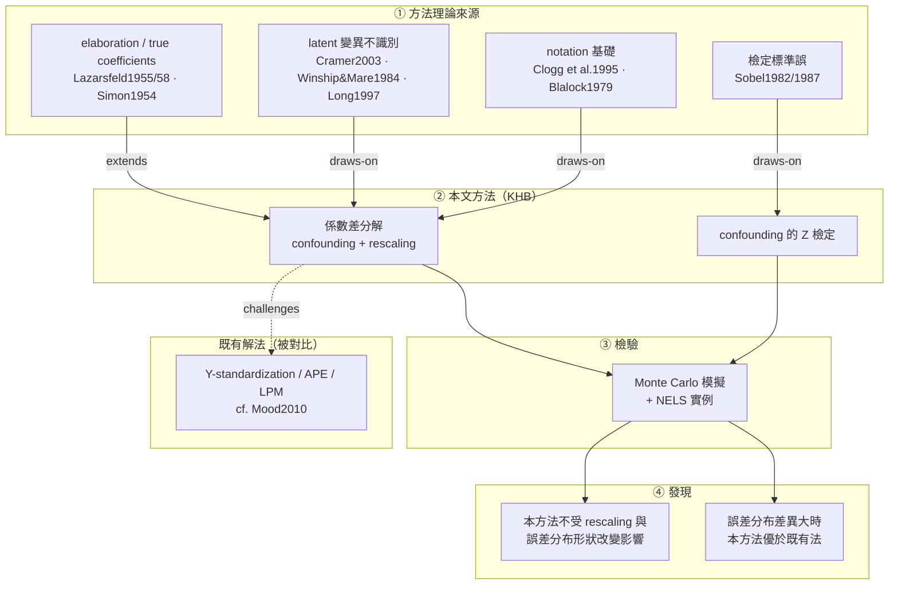

# Karlson, Holm & Breen (2012) — 壓力測試報告（4 步流程）

> 母本：`ltm-work/Karlson2012.md`（**pypdf** 版，非 markitdown）。定位 `L###` = pypdf 母本行號，可 grep 回溯。

## 第 1 步發現（流程缺陷）

- ❌ **markitdown 對本 PDF 失效**：SAGE 浮水印被 OCR 成重複字母雜訊，且系統性**吞掉字間空格**（`Logit,probit,rescaling`）→ 逐字引文無法乾淨呈現、grep 回溯失效。
- ✅ **pypdf 表現正確**（`Logit, probit, rescaling`）→ 改用 pypdf 為母本。
- ⚠️ **數學公式兩工具都擷取不全**（符號殘缺）→ C1 逐字引文**僅適用散文句**，公式類主張無法 grep，本報告對公式只做概念描述、標明限制。

→ **已回寫 SKILL.md**：step1 加「擷取後品質檢查（黏字率）+ pypdf fallback」。

---

## 1. 文章資訊（APA 7th）

> Karlson, K. B., Holm, A., & Breen, R. (2012). Comparing regression coefficients between same-sample nested models using logit and probit: A new method. *Sociological Methodology, 42*(1), 286–313. https://doi.org/10.1177/0081175012444861

- 期刊：*Sociological Methodology*（American Sociological Association）— SSCI 收錄（方法學頂刊）；quartile 本次未逐一查 JCR。
- 註：本方法後通稱 **KHB method**；作者提供 Stata 程式 `khb`（L1143，`drawing` 自證）。

## 2. 結構化重點摘要

**背景**
- logit/probit 廣用於社會學；常見做法是跨巢狀模型比較某變項 x 的係數，以評估 z 的 confounding／mediation（L78–81）。

**問題**
- 非線性模型中，x 係數跨模型差異**不只**來自 confounding，還來自 **rescaling**——因 latent 變項誤差變異**不識別**、跨模型不同（L130–141, "the error variance is not independently identified")。線性模型無此問題。
- 後果：天真比較會**低估** z 的中介/混淆角色（L154–160）。
- 進一步：誤差**分布**（非僅變異）也跨模型不同（L218–225）。

**方法（KHB）**
- 把 x 係數在含 z／不含 z 模型間的差，**分解**成 confounding 成分 + rescaling 成分（L92–95）。
- 推導標準誤與 Z 統計量，對 confounding 做**正式顯著性檢定**（L171, L558 drawing on Sobel）。
- 宣稱不受 rescaling 與誤差分布**形狀**改變影響（L168–170）。

**對比與發現**
- 對比三種既有解法：**Y-standardization、average partial effects (APE)、linear probability model (LPM)**（L730–732, cf. Mood 2010:80）。
- Monte Carlo：既有方法雖能處理 rescaling，但**誤差分布差異大時會對 confounding 做出錯誤推論**；本方法在所有情境**至少一樣好、有時更好**（L100–106）。
- 以 NELS（National Education Longitudinal Study）資料示範（L67）。

## 3. 理論（方法）建構釐清 — C1–C4

> ⚠️ 同前：描述「本文如何建構/使用方法」（citation context），非原典主張查證。公式類因擷取限制不附逐字引文。

### 3.1 理論來源（L1）
| 概念 | 文獻 | 逐字引文(C1) | 定位(C3) | evidence_type(C2) |
|---|---|---|---|---|
| elaboration／"true" coefficients 傳統 | Lazarsfeld 1955/1958、Kendall&Lazarsfeld 1950、Simon 1954 | "Interest in such genuine or ''true'' coefficients ... is usually associated with the elaboration procedure in cross-tabulation suggested by Lazarsfeld" | L81–84 | explicit |
| rescaling 問題早期陳述 | Winship & Mare 1984 | "despite an early statement of the problem by Winship and Mare (1984)" | L88–89 | explicit |
| 誤差變異不識別 | Cramer 2003 | "the error variance is not independently identified and is fixed at a given value (Cramer 2003:22)" | L139–141 | explicit |
| 模型 notation 基礎 | Clogg et al. 1995（cf. Blalock 1979） | "we follow the notation for linear models in Clogg et al. (1995; cf. Blalock 1979)" | L185–186 | explicit |
| 檢定統計量標準誤 | Sobel 1982/1987 | "drawing on Sobel (1982, 1987)" | L558 | explicit |

### 3.2 本文的方法操作（L2）
| 操作 | 逐字引文(C1) | 定位 | evidence_type |
|---|---|---|---|
| 係數差分解為 confounding + rescaling | "decomposes the difference in the logit or probit coefficient of x between a model excluding z and a model including z, into a part attributable to confounding ... and a part attributable to rescaling" | L92–95 | explicit |
| confounding 的 Z 檢定 | "We also derive standard errors and Z-statistics for formally assessing the degree of confounding" | L171–173 | explicit |

### 3.3 理論關係（L3，受控詞彙 C4）
| 關係 | 對象 | 逐字引文(C1) | 定位 | evidence_type |
|---|---|---|---|---|
| **draws-on** | Clogg et al. 1995 | "we follow the notation for linear models in Clogg et al. (1995)" | L185 | explicit |
| **draws-on** | Sobel 1982/1987 | "drawing on Sobel (1982, 1987)" | L558 | explicit |
| **extends** | Winship & Mare 1984 | "despite an early statement of the problem by Winship and Mare (1984)" | L88–89 | explicit |
| **challenges** | Y-standardization / APE / LPM（既有 rescaling 解法；cf. Mood 2010） | "other methods ... effectively deal with rescaling, they can lead to mistaken inferences about confounding if the error distributions are very different" | L100–103 | explicit |

> 群組分類與角色標籤（foundation/method-source/counter）為分析者歸納 → `interpreted`。

## 4. 方法架構圖

### 邊—證據對照（C1–C3）
| 邊 | relation | 引文 | 定位 |
|---|---|---|---|
| NOT→K1 | draws-on | "we follow the notation ... in Clogg et al. (1995)" | L185 |
| SOB→K2 | draws-on | "drawing on Sobel (1982, 1987)" | L558 |
| EL→K1 | extends | "an early statement of the problem by Winship and Mare (1984)" | L88–89 |
| K1⇢A1 | challenges | "they can lead to mistaken inferences about confounding if the error distributions are very different" | L100–103 |

## 5. 理論相關參考文獻查證（核心 6 筆 ✅；全文 27 筆，餘未逐筆查證）

| 內文 | APA 7th | 收錄 | 查證 |
|---|---|---|---|
| Clogg et al. 1995 | Clogg, C. C., Petkova, E., & Haritou, A. (1995). Statistical methods for comparing regression coefficients between models. *American Journal of Sociology, 100*(5), 1261–1293. | SSCI | ✅ |
| Winship & Mare 1984 | Winship, C., & Mare, R. D. (1984). Regression models with ordinal variables. *American Sociological Review, 49*(4), 512–525. https://doi.org/10.2307/2095465 | SSCI | ✅ |
| Mood 2010 | Mood, C. (2010). Logistic regression: Why we cannot do what we think we can do, and what we can do about it. *European Sociological Review, 26*(1), 67–82. https://doi.org/10.1093/esr/jcp006 | SSCI | ✅ |
| Allison 1999 | Allison, P. D. (1999). Comparing logit and probit coefficients across groups. *Sociological Methods & Research, 28*(2), 186–208. https://doi.org/10.1177/0049124199028002003 | SSCI | ✅ ⚠️ |
| Cramer 2003 | Cramer, J. S. (2003). *Logit models from economics and other fields*. Cambridge University Press. | 專書 | ✅ |
| Sobel 1982 | Sobel, M. E. (1982). Asymptotic confidence intervals for indirect effects in structural equation models. In S. Leinhardt (Ed.), *Sociological methodology* (Vol. 13, pp. 290–312). Jossey-Bass. | 專書系列 | ✅ |

> ⚠️ **書目存疑**：原文 reference 把 Allison 1999 標為 *28(3)*，但查證來源（SAGE DOI 10.1177/0049124199028002003）為 **28(2)**（1999 年 11 月號）。原文卷期號可能小誤。

---

## 壓力測試結論

1. **流程在陌生論文上守住了 C1–C4**：所有理論關係皆 `explicit` + 逐字引文 + 可 grep 行號；無需先驗知識。
2. **揪出 2 個真實流程缺陷**：(a) markitdown 對某些 PDF 失效 → 需品質檢查 + pypdf fallback；(b) 數學公式無法可靠擷取 → C1 限定散文句、公式標限制。
3. **查證附帶價值**：抓到原文 Allison 1999 的卷期號可能誤標（28(3)→28(2)）。
